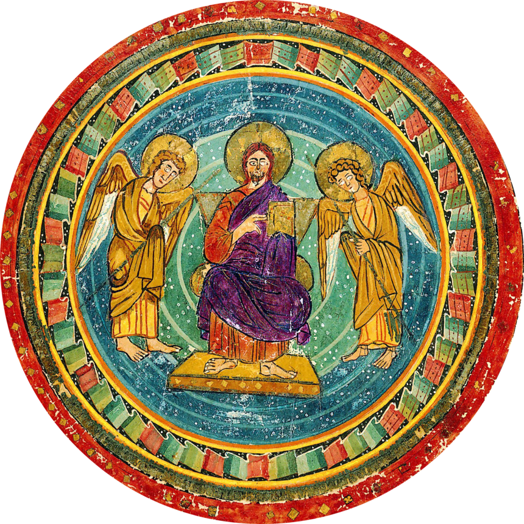

# Codex Amiatinus — New Testament

## Textual Characteristics
Based upon [https://archive.org/details/codexamiatinusno00tsch/mode/2up](Codex Amiatinus - Novus Testamentum Latine) by Constantin von Tischendorf, revised as described.
In keeping with the uncial of the manuscript, the transcription is fully capitalized. V and J are replaced with U and I as it appears in the manuscript. No punctuation is added. The only separation in the text is by chapters, according to the modern division of the Gospels into chapters. Nomina sacra (abbreviated forms of certain sacred words) in the manuscript are retained here. They are indicated by [square brackets].
| Nomina Sacra | Expanded Form |
| --- | --- |
| \[DS\] | DEUS |
| \[DI\] | DEI |
| \[DM\] | DEUM |
| \[DO\] | DEO |
| \[DNS\] | DOMINUS |
| \[DNI\] | DOMINI |
| \[DNM\] | DOMINUM |
| \[DNO\] | DOMINO |
| \[IHS\] | IESUS |
| \[IHM\] | IESUM |
| \[IHU\] | IESU |
| \[XPS\] | CHRISTUS |
| \[XPI\] | CHRISTI |
| \[XPM\] | CHRISTUM |
| \[XPO\] | CHRISTO |
| \[SPS\] | SPIRITUS |
| \[SPI\] | SPIRITI |
| \[SPM\] | SPIRITUM |
| \[SPO\] | SPIRITO |
| \[SPU\] | SPIRITU |
| \[SCS\] | SANCTUS |
| \[SCI\] | SANCTI |
| \[SCM\] | SANCTUM |
| \[SCO\] | SANCTO |

## Gospels
- [x] Matthew
- [x] Mark
- [x] Luke
- [x] John
